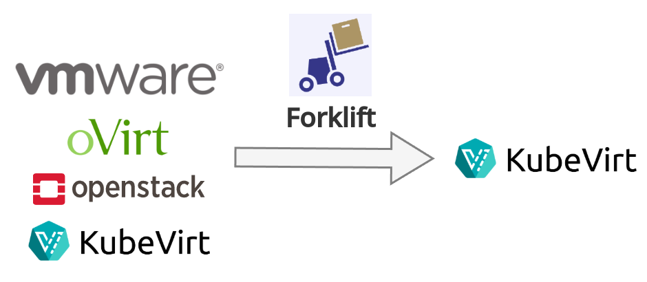

&nbsp;&nbsp;[](https://codecov.io/gh/kubev2v/forklift)

# Forklift
Migrates virtual machines at scale to Kubernetes KubeVirt.
Migrations are performed in a few simple steps, first by providing source and destination credentials,
then mapping the source and destination infrastructure and creating a choreographed plan, and finally,
executing the migration effort.


## Features
- **Warm migration** using Change Block Tracking/Incremental Backup to reduce the downtime, supported in VMware and oVirt migrations.
- For VMware migrations, the Forklift uses [virt-v2v](https://libguestfs.org/virt-v2v.1.html) **guest conversions** which installs the virtio drivers and edits the guest to run on QEMU-KVM.
- Migrating to **remote clusters**, user can install the Forklift on one cluster and orchestrate other cluster to do the migration.
- Migrating VMs **between clusters** using the KubeVirt [Export API](https://kubevirt.io/user-guide/storage/export_api/).
- **Validations** of the Virtual Machines to let users know if migration plan has issues that need to be addressed before running.
---

## Deploy
Deploy the Forklift operator index to the cluster.

For single-architecture deployment (development):
```bash
make deploy-operator-index PLATFORM=linux/amd64 REGISTRY_TAG=latest
```

For multi-architecture deployment (production):
```bash
make deploy-operator-index-multiarch REGISTRY_TAG=latest
```


## Build
Custom build of the controller, bundle and index which will be deployed to the cluster
```bash
export REGISTRY_ORG=user
make push-controller-image \
     push-operator-bundle-image \
     push-operator-index-image \
     deploy-operator-index
```
Note: The order of targets is important as the bundle needs to be created after controller and index after bundle.

### Multi-Architecture Builds

For information about building images for multiple architectures (AMD64, ARM64) and creating multi-arch manifests, see the [Cross-Platform Build Support](docs/enhancements/cross-platform-build-support.md) enhancement document.

## Development

### Commit Message Format

All commits must include one of these formats in the **commit description** (the body of the commit message):

**Primary format**: `Resolves: MTV-<number>`

Example commit:
```
Subject: Fix bug in data processing
Description: Resolves: MTV-123
```

**Exclusion format**: `Resolves: None`

Example commit:
```
Subject: Update documentation
Description: Resolves: None
```

**Chore commits**: Any commit containing "chore" in the message (case insensitive) is automatically skipped.

Example chore commits:
```
chore: update dependencies
CHORE: clean up build files
Update dependencies and chore tasks
```

**Note**: The commit description validation is enforced via a GitHub Action that runs on all branches for push and pull request events. The validation automatically skips:
- Bot users (dependabot, renovate, ci, github-actions, etc.)
- Commits containing "chore" in the message (case insensitive)

### Local Validation

You can validate commit messages locally using the provided script or Makefile targets:

**Using Makefile targets:**
```bash
# Validate the latest commit
make validate-commits

# Validate a range of commits
make validate-commits-range RANGE="HEAD~5..HEAD"
```

**Using the script directly:**
```bash
# Validate the latest commit
./scripts/validate-commits.sh

# Validate a range of commits
./scripts/validate-commits.sh --range HEAD~5..HEAD

# Validate with verbose output
./scripts/validate-commits.sh --verbose

# Get help
./scripts/validate-commits.sh --help
```

### Detailed Commit Message Guide

For comprehensive information about commit message formatting, supported issue tracking systems, and troubleshooting, see [COMMIT_MESSAGE_GUIDE.md](./COMMIT_MESSAGE_GUIDE.md).

### Configuration

| Name                       | Default value                                  | Description                                                            |
|----------------------------|------------------------------------------------|------------------------------------------------------------------------|
| REGISTRY_TAG               | devel                                          | The tag with which the image will be built and pushed to the registry. |
| REGISTRY_ORG               | kubev2v                                        | The registry organization to which the built image should be pushed.   |
| REGISTRY                   | quay.io                                        | The registry address to which the images should be pushed.             |
| PLATFORM                   | linux/amd64                                    | The target platform for container image builds (e.g.: linux/arm64, linux/amd64). |
| CONTAINER_CMD              | autodetected                                   | The container runtime command (e.g.: /usr/bin/podman)                  |
| VERSION                    | 99.0.0                                         | The version with which the forklift should be built.                   |
| NAMESPACE                  | konveyor-forklift                              | The namespace in which the operator should be installed.               |
| CHANNELS                   | development                                    | The olm channels.                                                      |
| DEFAULT_CHANNEL            | development                                    | The default olm channel.                                               |
| OPERATOR_IMAGE             | quay.io/kubev2v/forklift-operator:latest       | The forklift operator image with the ansible-operator role.            |
| CONTROLLER_IMAGE           | quay.io/kubev2v/forklift-controller:latest     | The forklift controller image.                                         |
| MUST_GATHER_IMAGE          | quay.io/kubev2v/forklift-must-gather:latest    | The forklift must gather an image.                                     |
| UI_PLUGIN_IMAGE            | quay.io/kubev2v/forklift-console-plugin:latest | The forklift OKD/OpenShift UI plugin image.                            |
| VALIDATION_IMAGE           | quay.io/kubev2v/forklift-validation:latest     | The forklift validation image.                                         |
| VIRT_V2V_IMAGE             | quay.io/kubev2v/forklift-virt-v2v:latest       | The forklift virt v2v image for cold migration.                        |
| VDDK_IMAGE                 |                                                | The default Virtual Disk Development Kit (VDDK) image, default empty.  |
| POPULATOR_CONTROLLER_IMAGE | quay.io/kubev2v/populator-controller:latest    | The forklift volume-populator controller image.                        |
| OVIRT_POPULATOR_IMAGE      | quay.io/kubev2v/ovirt-populator:latest         | The oVirt populator image.                                             |
