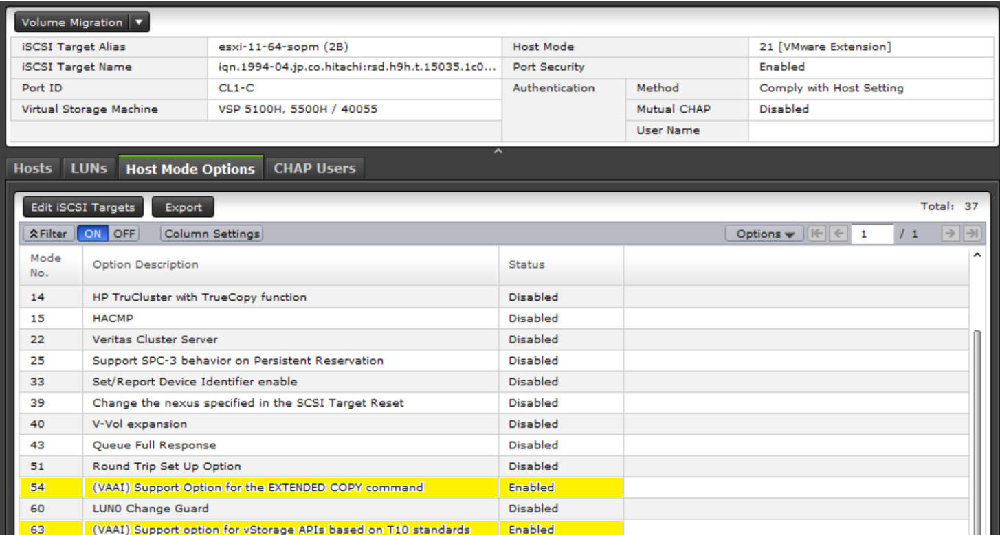

# Secret with storage provider credentials
The secret with the storage provider credentials must be created in the same namespace
as the `StorageMap` object. The secret contains the following

## data:
|key|required or optional|value|
|---|----|-----|
|GOVMOMI_HOSTNAME|required|vSphere's API hostname, URL|
|GOVMOMI_USERNAME|required|vSphere's API username|
|GOVMOMI_PASSWORD|required|vSphere's API password|
|STORAGE_HOSTNAME|required|The storage vendor api hostname, URL|
|STORAGE_USERNAME|required|The storage vendor api username|
|STORAGE_PASSWORD|required|The storage vendor api password|
|STORAGE_PORT|required|The storage vendor api port|
|STORAGE_ID|required|storage array serial number|
|HOSTGROUP_ID_LIST|required|list of IO ports and host group IDs, (e.g. CL1-A,1:CL2-B,2:CL4-A,1:CL6-A,1) |

## Host Mode Options:

To enable **VOLUME-XCOPY** from the storage end, the following configuration needs to be enabled via **storage-navigator**:

- Identify the port used in the datastore where original vms are present.
- Identify the Host Group name and ID.
- Select Host Mode Options and enable the following:

    - **Mode No. 54**
        - Option Description: *(VAAI)* Support Option for the **EXTENDED COPY** command
        - Status: **Enabled**

    - **Mode No. 63**
        - Option Description: *(VAAI)* Support Option for **vStorage APIs** based on T10 standards
        - Status: **Enabled**

