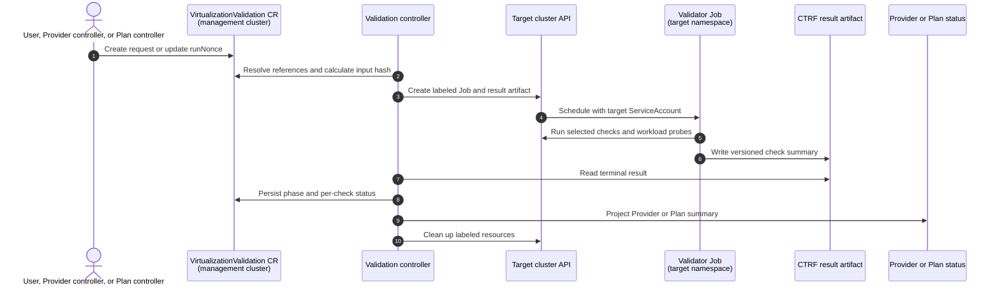
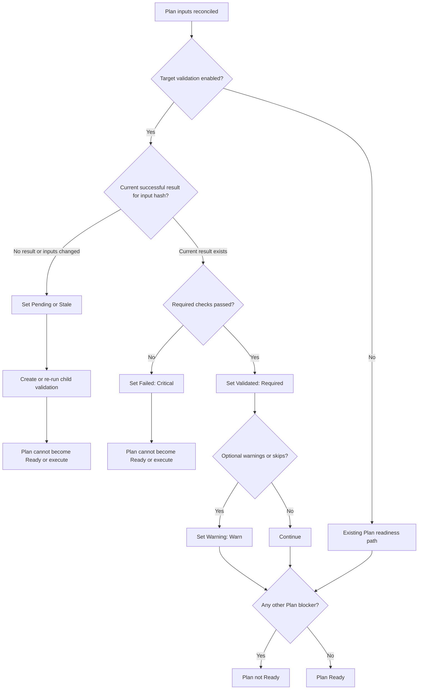

# Target OpenShift Virtualization Validation

## Release Signoff Checklist

- [ ] Enhancement is `implementable`
- [ ] Design details are appropriately documented from clear requirements
- [ ] Test plan is defined
- [ ] User-facing documentation is created

## Summary

Forklift can currently validate connectivity to an OpenShift target, but it
cannot establish that OpenShift Virtualization can perform the operations a
migration needs. A target may therefore appear ready while VM scheduling,
selected storage, live migration, or snapshots fail.

This proposal introduces a `VirtualizationValidation` CR in the Forklift API.
It is a reusable, stand-alone request/result resource. It can be run as a
lightweight Provider validation or created by a Plan to validate that Plan's
actual target namespace, service account, and storage path. A short-lived Job
on the target cluster executes a trusted validator image based on
[`openshift-cnv/virt-cluster-validate`](https://github.com/openshift-cnv/virt-cluster-validate).

Provider validation is advisory except when required virtualization APIs are
unavailable. Plan validation is a readiness gate: a Plan cannot become Ready
or execute until all of its required target checks have passed.

Detailed rationale, API/status sketches, risks, and UI design notes are kept
in [the supporting design notes](./target-virtualization-validation.md).

## Motivation

Provider registration and Plan readiness need different levels of evidence.
A Provider answers whether a cluster is generally usable; a Plan has the
additional context required to test an actual target namespace and its mapped
storage. Running VM workload probes during Provider registration would be
unexpected and still could not validate the later Plan choices.

The `virt-cluster-validate` PoC already offers a containerized, extensible
check runner with time-bounded shell checks, cleanup behavior, and CTRF/JUnit
results. It includes baseline checks for VM start, live migration, and
snapshot/restore. Forklift should reuse it as an execution engine, rather than
duplicate generic checks in controller code, while retaining ownership of
Forklift API, lifecycle, policy, and Plan-specific inputs.

### Goals

* Provide a Kubernetes-native, stand-alone validation API with durable results.
* Reuse the PoC runner for generic checks and build a supported MTV integration
  around it.
* Run lightweight Provider checks and stronger Plan-aware workload checks.
* Block Plan readiness on failed required Plan checks, not on Provider warnings.
* Make checks, cleanup, results, image versions, and reruns observable.
* Preserve least privilege: never put a Provider credential in a target Job.

### Non-Goals

* Certifying every CSI driver, workload, or platform configuration.
* Replacing OpenShift Virtualization conformance or must-gather.
* Performance benchmarking or guest-application testing.
* Providing arbitrary user shell execution through a Forklift CR.

## Proposal

### API boundary

Add `VirtualizationValidation` to `forklift.konveyor.io/v1beta1`. A validation
references an OpenShift Provider and has either a `Provider` or `Plan` profile.
`Plan` profile additionally references a Plan and must use that Plan's target
Provider and target namespace.

```yaml
apiVersion: forklift.konveyor.io/v1beta1
kind: VirtualizationValidation
metadata:
  name: cluster-abc-1-readiness
  namespace: openshift-mtv
spec:
  providerRef:
    name: cluster-abc-1
  profile: Plan
  planRef:
    name: cluster-abc-1-migration
  executionNamespace: cluster-abc-1-target
  checks: [platform, vm-start, live-migration, snapshot-restore]
  execution:
    image: registry.example/mtv/virt-validation@sha256:...
    serviceAccountName: virt-validation
    timeout: 12m
    cleanupPolicy: Always
  runNonce: "2026-09-09T15:30:00Z"
```

Status records a phase, observed input hash, run ID, target Job reference,
bounded per-check results, and result-artifact references. `runNonce` triggers
an explicit rerun. Automatic runs use an input hash so a change to relevant
Provider/Plan/storage/service-account/image inputs invalidates an old result.

The CRD is not a shell-execution API. Check IDs are selected from a trusted,
versioned catalog shipped in the validator image. Unknown IDs are rejected or
fail preflight; inputs are passed structurally, not interpolated into commands.

### Profiles and triggering

| Profile | Initiator | Scope | Readiness effect |
|---|---|---|---|
| Provider | User, automation, or opt-in Provider controller | APIs, OpenShift Virtualization readiness, schedulable nodes, storage/snapshot discovery, authorization preflight | Advisory, except absent required virtualization capability blocks Provider Ready |
| Plan | User or Plan controller | Provider checks plus one disposable VM using the Plan's namespace, service account, and selected storage | Required checks block Plan Ready and execution |

Automatic Provider validation is opt-in and requires an explicitly configured
execution namespace. Existing Provider behavior does not change by default.
The Plan controller creates a same-cluster child validation CR once its normal
references and mappings are valid. Users and automation can create the CR
directly for a stand-alone run.

### Execution and ownership



The Forklift controller uses the Provider credential only to manage the target
Job and result artifact. The target Job uses a pre-provisioned, namespaced
ServiceAccount to execute checks. Provider credentials are never mounted into
the Job. Cross-cluster owner references are not possible, so target resources
are labeled with validation UID and cleaned up by both the runner and the
controller.

#### Hub-and-spoke targets

This design supports Forklift running on a hub cluster and validating a spoke
target cluster. The `VirtualizationValidation` CR and controller remain on the
hub; the Provider reference supplies the spoke API connection; and the
validator Job, its ServiceAccount, and all disposable test resources run only
on the spoke. No Forklift CR needs to be installed or synchronized on the
spoke. The spoke must permit the Provider credential to manage the Job/result
artifact, provide the target Job ServiceAccount and its scoped permissions, and
be able to pull the mirrored validator image. These are the same remote-target
boundaries as a local target, but need explicit connectivity and image-mirror
documentation.

For Plan validation, the initial probe is sequential: verify authorization,
create a small test volume on the selected destination storage, start one VM,
request its live migration, snapshot it (and optionally restore it), then
clean up in reverse order. This must be a composed MTV check, not three
independent PoC checks, because it needs one shared VM and the exact Plan
storage configuration.

### Status and Plan readiness

The validation CR is the detailed record. Provider and Plan status carry only
the current summary and a reference to the CR; API clients must inspect the CR
for per-check evidence.

Provider projections are `VirtualizationAvailable`, the critical
`VirtualizationUnavailable`, `VirtualizationValidationInProgress`, advisory
failure/warning conditions, and `VirtualizationValidationStale`. A successful
Provider run does not prove that an individual Plan can run.

Plan projections are `TargetVirtualizationValidationPending`, the critical
`TargetVirtualizationValidationFailed`, optional
`TargetVirtualizationValidationWarning`,
`TargetVirtualizationValidated`, and
`TargetVirtualizationValidationStale`. Pending and stale states must suppress
Plan readiness without being critical errors; failed required checks are
critical. The current Plan ready predicate has a special pending case for
VDDK validation, so it must be extended for these two target-validation
pending conditions.



## Repository and image ownership

| Repository | Responsibility |
|---|---|
| `kubev2v/forklift` | CRD and controller; Provider/Plan projection; Job template, cleanup, result parsing, RBAC/samples/docs; MTV-specific composed check; validator-image release/CSV related-image wiring |
| `openshift-cnv/virt-cluster-validate` | Generic runner and broadly useful OpenShift Virtualization checks; stable machine-output contract and generic parameterization contributed upstream |
| Console-plugin source repository | Consume CRD/status; present summaries, details, and authorized actions. This repository only packages its image/deployment manifests. |

The recommended artifact is a distinct Forklift-owned image, tentatively
`forklift-virt-validation`, built from a pinned
`virt-cluster-validate` source/image revision with the MTV check catalog and
Plan workload check layered on top. It is a related image of the operator and
is released/mirrored with MTV. This avoids consuming an unpinned PoC `latest`
image and supports disconnected installations. It is separate from the
existing `forklift-validation` OPA image, which evaluates source-inventory VM
concerns.

## UI implications

Provider and Plan views use their status projections for compact state and
link to the referenced validation CR for detail. They must not infer a result
from Job existence or log output.

* Provider details show target virtualization as available, checking, needs
  attention, unavailable, not configured, or stale, plus an authorized
  lightweight **Run validation** action.
* Plan details show target validation as a named readiness prerequisite. While
  pending/stale it explains that validation is required; failures appear among
  blockers; warnings preserve Ready; success shows the validated input summary
  and timestamp.
* A shared detail view shows per-check outcomes, concise remediation, run/image
  identity, and permitted artifact links. Rerun, cancellation, and cleanup are
  permission-aware and unavailable while the Plan executes.

The console plugin requires list/get/watch permission for the new CR and
separate write permission for actions. It uses Provider/Plan summaries on list
pages and fetches the referenced validation CR only on detail views.

## Key risks and constraints

* The PoC currently assumes a default DataSource/storage in some workload
  checks and uses a snapshot API version that must be tested across supported
  OpenShift Virtualization releases. The MTV composed check must not inherit
  those assumptions.
* Single-node clusters cannot demonstrate live migration. That result must be
  explicitly skipped/warned unless the Plan requires it; it is not a generic
  VM-start failure.
* Quota, SCC/PSA, admission, target image pull, and remote RBAC failures must
  retain the API error and failing check ID in status.
* Test resources create real cost and load. Limit concurrent runs per target
  namespace/provider, time-box each operation and the whole run, and label all
  resources for cleanup and debugging.
* Detailed results belong in a versioned target artifact; status remains small.
  Logs are diagnostic evidence, not the controller-to-UI result protocol.

## Alternatives

1. **Controller performs all checks directly.** Removes the Job/image but
   duplicates the generic runner and makes checks less reusable.
2. **Use the PoC image unchanged.** Good for a spike, but its default storage
   assumptions and independent VM checks are not safe as a Plan readiness gate.
3. **Put state only on Provider/Plan.** Smaller API surface but no stand-alone
   trigger, durable run detail, artifact references, or clean lifecycle boundary.
4. **Create Jobs directly from Plan controller.** Reuses the VDDK pattern but
   duplicates Provider/stand-alone behavior and overloads Plan reconciliation.
5. **Run VM probes on every Provider automatically.** Finds some issues early,
   but surprises users and cannot validate Plan-specific storage/namespace.
6. **Use a dedicated MTV ConfigMap instead of a validation CR/controller.** A
   ConfigMap could configure the validator image, enabled check profiles,
   defaults, and perhaps carry an imperative request. This is reasonable for
   cluster-wide policy/defaults and can avoid a new CRD for a limited
   controller-owned workflow. It is not a suitable stand-alone run/result API:
   ConfigMaps have no typed lifecycle or status subresource, no stable run ID or
   input-generation semantics, no owner relationship to target resources, and
   poor concurrency/history behavior. Using arbitrary keys or free-form payloads
   would also make Provider/Plan scoping, validation, RBAC, UI state, retries,
   cleanup, and auditability dependent on conventions and Pod logs. If chosen,
   this approach should be explicitly limited to defaults; existing Provider/
   Plan controllers would still need to own a constrained Job lifecycle and
   project results into their status.

## Open questions for review

1. Do maintainers agree that `VirtualizationValidation` is the right durable
   API boundary, rather than extending Provider/Plan status only?
2. Which Plan operations are required initially: VM start, migration, snapshot,
   and/or restore? Should snapshot/restore be policy-driven per Plan?
3. Which supported test DataSource/image works for connected and disconnected
   clusters, and who owns its lifecycle?
4. Should Forklift ship sample target Roles only, or optionally install narrow
   Roles/RoleBindings when authorized?
5. Where will the derived image be released and signed, and which overrides,
   if any, are acceptable?
6. Is a future administrator-approved extension-image mechanism desired, or
   should extensions only arrive through upstream/Forklift releases?
7. Is a ConfigMap-only implementation acceptable for an initial limited
   workflow, knowing that it cannot provide the proposed stand-alone,
   durable run API without reintroducing equivalent state elsewhere?

## Verification and rollout

The feature is disabled by default. Phase one delivers the stand-alone CR and
read-only Provider profile; phase two adds Plan-triggered workload validation
and the readiness gate. Unit tests cover status/input-hash/retry/cleanup logic;
integration tests cover supported VM start, migration, snapshot/restore, and
expected RBAC/quota/image/API failures. Console-plugin contract tests consume
recorded CR status fixtures.

On upgrade, existing Provider and Plan behavior is unchanged until enabled.
Documentation must cover target roles, image mirroring, resource impact,
timeout/cleanup behavior, and a rollback procedure for active validations.
