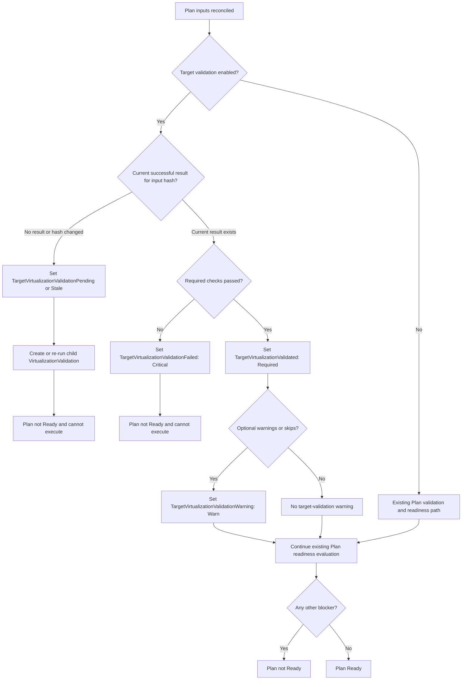
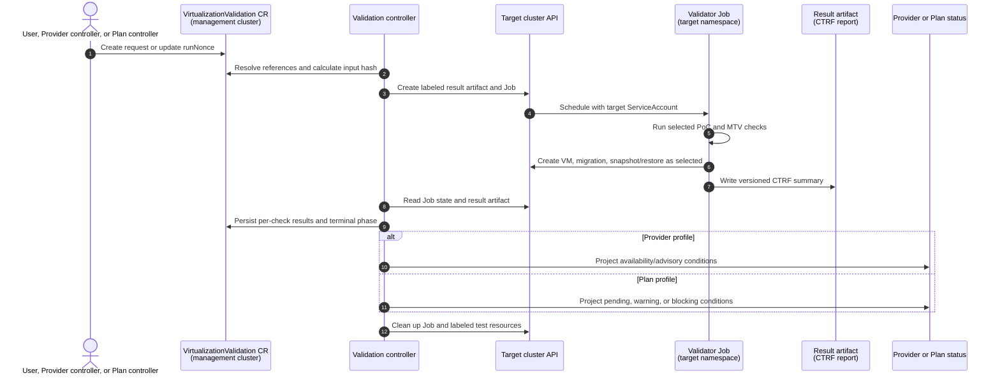

# Target OpenShift Virtualization Validation: Design Notes

> This document preserves detailed design material for implementation and
> follow-up review. Start with
> [the compact proposal](./target-virtualization-validation-proposal.md) for
> the initial design decision.

## Release Signoff Checklist

- [ ] Enhancement is `implementable`
- [ ] Design details are appropriately documented from clear requirements
- [ ] Test plan is defined
- [ ] User-facing documentation is created

## Summary

Forklift currently validates that an OpenShift provider can be contacted and,
for a remote provider, performs API discovery to determine whether Forklift is
installed. It does not establish that the target OpenShift Virtualization
environment can run the workload operations on which a migration depends.
In particular, a target can appear healthy and a Plan can be Ready while VM
scheduling, the selected target storage, live migration, or snapshots fail.

This proposal adds a Forklift API for recording and executing target
virtualization validation. The API is represented by a new
`VirtualizationValidation` custom resource (CR). It can be created directly,
created automatically for a Provider in a lightweight mode, or created by a
Plan in a workload-aware mode. The CR is the durable record of one validation
request and its results; a short-lived Job on the target cluster executes the
checks.

The generic test runner and baseline checks are reused from
[`openshift-cnv/virt-cluster-validate`](https://github.com/openshift-cnv/virt-cluster-validate).
Forklift owns the CRD, lifecycle controller, result mapping, and checks that
need Plan-specific inputs. Provider results are advisory except when the
target lacks required virtualization APIs. Plan results are blocking: a Plan
cannot become Ready until its required target validation succeeds.

## Motivation

The useful question changes over the lifecycle of a migration:

* When registering a target Provider, operators need a low-impact answer to
  "is this an OpenShift Virtualization target that Forklift can use?"
* When a Plan has selected a namespace, storage mappings, service account, and
  migration/network settings, operators need a stronger answer to "can this
  exact target path start, migrate, and snapshot a VM?"
* Platform teams need to run either check without manufacturing a migration
  Plan, retain machine-readable evidence, and retry after remediation.

The existing provider connection validation cannot answer the latter two
questions. Conversely, automatically creating VMs during Provider creation
would be surprising, requires a namespace and permissions that may not exist,
and cannot test the storage chosen later by a Plan.

`virt-cluster-validate` is a good execution foundation. At the revision
reviewed for this proposal (`1c371c7664e81cbfbe1a1b0cd19938f500e69f68`), it
has a container image, independent extensible shell checks, time bounds,
cleanup traps, and CTRF/JUnit output. It already contains checks for basic VM
creation, live migration, snapshot/restore, and many read-only cluster checks.
It is intentionally a CLI/check runner, not a Kubernetes API or a Forklift
Plan controller; those responsibilities belong here.

### Goals

* Provide a versioned, stand-alone, Kubernetes-native API for a target
  virtualization validation run.
* Reuse the PoC runner/image rather than reimplementing generic cluster checks
  in the Forklift controller.
* Provide a lightweight Provider profile and a Plan profile that is evaluated
  using the Plan's target namespace and storage configuration.
* Make Plan-profile failures block Plan readiness, with specific conditions and
  remediation information.
* Make run state, selected inputs, per-check outcomes, and result artifacts
  durable and queryable after the Job finishes.
* Make test resource creation bounded, identifiable, and reliably cleaned up.
* Allow controlled extension of checks without changing the CRD for every new
  check.

### Non-Goals

* Certifying every OpenShift Virtualization configuration, workload type, or
  third-party CSI driver.
* Replacing OpenShift Virtualization conformance, must-gather, or the PoC's
  broad cluster-health checks.
* Benchmarking migration performance or imposing minimum throughput/latency.
* Testing a guest application's correctness, connectivity, or data integrity.
* Executing arbitrary user-supplied shell code through a Forklift CR.
* Copying a Provider bearer token or kubeconfig into a test Pod.
* Changing existing Provider behavior unless the feature is enabled.

## Proposal

### Concepts

`VirtualizationValidation` is a request and result resource in the Forklift
management cluster. It references an OpenShift Provider and selects one of two
profiles:

* **Provider profile** validates reachability, API/operator readiness, node
  eligibility, installed capabilities, and authorization. It is intended to
  be quick and normally read-only. It may run when a Provider is registered or
  as a stand-alone request.
* **Plan profile** includes Provider checks and runs disposable workload probes
  in the Plan's target namespace. It is intended to validate the actual
  namespace, service account, destination StorageClass, snapshot support, and
  migration path selected for that Plan.

A check result has one of `Passed`, `Warning`, `Failed`, or `Skipped`. A
`Skipped` result is never silently converted to `Passed`; its reason is part
of the status. Whether it blocks is determined by the profile and the
configured required-check set.

### Proposed API

The exact Go type and generated schema are subject to API review. This sketch
illustrates the intended boundary, not a final field spelling:

```yaml
apiVersion: forklift.konveyor.io/v1beta1
kind: VirtualizationValidation
metadata:
  name: cluster-abc-1-readiness
  namespace: openshift-mtv
spec:
  providerRef:
    name: cluster-abc-1
  profile: Plan                         # Provider | Plan
  planRef:
    name: cluster-abc-1-migration        # required for Plan
  executionNamespace: cluster-abc-1-target # must equal Plan target for Plan
  checks:
    - platform
    - vm-start
    - live-migration
    - snapshot-restore
  execution:
    image: registry.example/mtv/virt-validation@sha256:...
    serviceAccountName: virt-validation
    timeout: 12m
    cleanupPolicy: Always                # Always | OnSuccess | Retain
  runNonce: "2026-09-09T15:30:00Z"       # change to explicitly rerun
status:
  phase: Succeeded                       # Pending | Running | Succeeded | Failed | CleaningUp
  observedInputHash: sha256:...
  started: "2026-09-09T15:30:13Z"
  completed: "2026-09-09T15:34:04Z"
  targetJobRef:
    namespace: cluster-abc-1-target
    name: mtv-target-validation-abcde
  results:
    - id: vm-start
      outcome: Passed
      message: Test VMI became Running.
      started: "..."
      completed: "..."
    - id: live-migration
      outcome: Passed
      message: VMI migration completed on a distinct node.
  artifacts:
    - kind: ConfigMap
      namespace: cluster-abc-1-target
      name: mtv-target-validation-abcde-results
```

API validation rules must enforce the following:

* `providerRef` is required and must resolve to an OpenShift Provider.
* `Plan` profile requires `planRef`; its target Provider and target namespace
  must agree with the referenced Plan. Callers cannot point a Plan validation
  at another Provider or namespace.
* `Provider` profile must not request destructive workload checks.
* `checks` are IDs from the image's supported, versioned catalog. Unknown IDs
  fail admission or set a clear preflight failure; they are not passed through
  as shell text.
* The image is either an administrator-controlled default or an allowlisted,
  digest-pinned override. Mutable image tags are not a reproducible execution
  contract.
* `runNonce` is the explicit manual rerun mechanism. An input fingerprint also
  triggers a new automatic run when relevant inputs change.

The API should initially remain `v1beta1`, with an explicit conversion plan
before `v1`. The result list must be bounded: detailed logs belong in target
artifacts, while CR status carries a concise summary and references.

### Triggering and ownership

| Initiator | Profile | Trigger | Result consumption |
|---|---|---|---|
| User or automation | Provider or Plan | Create CR or change `runNonce` | Read CR status and artifacts |
| Provider controller | Provider | Feature enabled; Provider becomes connected or relevant Provider inputs change | Provider gets advisory summary conditions |
| Plan controller | Plan | Plan's target inputs are valid, then validation is missing/stale | Plan gets blocking readiness conditions |

The Plan controller creates a deterministically named child CR in the Plan's
namespace and owns it with a normal same-cluster owner reference. It waits for
that CR rather than executing remote workload actions inside its normal
validation functions. The Provider controller may use the same pattern, but
only when an administrator enables automatic Provider validation and configures
an execution namespace. This avoids unexpected Jobs on every Provider created
by an existing installation.

The remote Job cannot have an owner reference to a CR in the management
cluster; Kubernetes owner references do not cross clusters. Forklift therefore
uses labels containing the validation UID and a cleanup state machine.

### Status and condition contract

The validation CR is the detailed source of truth. Provider and Plan status
are intentionally concise projections of the latest relevant validation; they
must not duplicate every check, Job transition, or log line. This keeps the
existing status surfaces usable and gives API clients one unambiguous resource
to inspect for detailed evidence.

The implementation must use the existing Forklift condition structure
(`type`, `status`, `reason`, `category`, `message`, `suggestion`, `items`) and
its staging semantics. A controller must re-stage projected conditions on each
reconcile; otherwise `EndStagingConditions()` removes them. The conditions
listed below describe the external contract, not an instruction to add a new
generic condition framework.

#### `VirtualizationValidation` status

`status.phase` is a coarse lifecycle value for humans and simple clients:
`Pending`, `Running`, `Collecting`, `CleaningUp`, `Succeeded`, or `Failed`.
It must not be used as the sole success signal. Terminal success means every
required selected check passed and required cleanup completed (unless `Retain`
was explicitly selected).

The CR conditions are:

| Condition type | Category when true | Meaning |
|---|---|---|
| `Ready` | Required | All required selected checks have passed for the observed input hash. |
| `ValidationRunning` | Advisory | The controller has accepted the run and it is not terminal. |
| `ValidationFailed` | Critical | At least one required check failed, or the Job/result contract could not complete. `Items` contains failed check IDs. |
| `ValidationWarning` | Warn | One or more optional checks warned, failed, or were skipped according to policy. `Items` contains their IDs. |
| `ValidationCleanupFailed` | Warn | Test artifacts could not be fully removed. The message and artifact references identify what remains. |
| `ValidationInputInvalid` | Critical | References, profile constraints, or requested checks cannot be resolved. No target Job is created. |
| `ValidationImageUnavailable` | Critical | The selected validator image could not be pulled or is incompatible with the requested catalog contract. |

`status.observedGeneration`, `status.observedInputHash`, and a `status.runID`
make it possible to distinguish a past success from the current request. Each
result includes check ID, outcome, started/completed time, concise message,
and a remediation suggestion. The complete CTRF report remains an artifact
reference. The controller must never set `Ready=True` while `Running` is true
or while the status refers to an older input hash.

#### Provider status projection

Provider conditions answer whether the Provider is a usable target in general;
they do not claim that every Plan targeting it is validated. Proposed types:

| Condition type | Category | Meaning and readiness effect |
|---|---|---|
| `VirtualizationUnavailable` | Critical | The target lacks required virtualization APIs or usable base platform. Its presence blocks Provider Ready. |
| `VirtualizationAvailable` | Required | The target serves required virtualization APIs and has a usable base platform. It is the positive capability signal. |
| `VirtualizationValidationInProgress` | Advisory | A configured lightweight Provider run is active. It does not block Provider Ready. |
| `VirtualizationValidationFailed` | Warn | The latest Provider-profile run found advisory readiness concerns. It does not block Provider Ready. |
| `VirtualizationValidationWarning` | Warn | The latest Provider-profile run completed with non-fatal warnings/skips. |
| `VirtualizationValidationStale` | Advisory | A previously successful result no longer matches Provider inputs or policy. It does not claim a failure. |

The existing `ForkliftNotInstalled` warning remains separate: it describes
Forklift discovery on a remote OpenShift Provider, whereas
`VirtualizationAvailable` describes target virtualization capability. If
KubeVirt/OpenShift Virtualization is absent, `VirtualizationUnavailable` is a
critical provider condition; all other Provider-profile failures are warnings
unless a later policy explicitly elevates them.

Provider status should contain the validation CR name, run ID, completion time,
and input hash in a small optional `status.virtualizationValidation` summary.
That enables UI links and makes the latest result discoverable without listing
all validation CRs. It does not retain duplicate per-check results.

#### Plan status projection and readiness

Plan validation has a stricter contract. It must distinguish **waiting for a
required target validation** from **a failed target validation**. Merely using
an Advisory in-progress condition would be incorrect: the current Plan
controller sets `Ready=True` whenever there is no blocker (except its special
VDDK-pending condition).

Proposed types:

| Condition type | Category | Meaning and readiness effect |
|---|---|---|
| `TargetVirtualizationValidationPending` | a new readiness-pending category, analogous to `ValidatingVDDK` | Required Plan validation has not reached a terminal result; Plan must not be Ready or executable. |
| `TargetVirtualizationValidationFailed` | Critical | One or more required Plan-profile checks failed; Plan is not Ready. `Items` lists check IDs. |
| `TargetVirtualizationValidationWarning` | Warn | Optional results require attention but do not block the Plan. |
| `TargetVirtualizationValidated` | Required | Required Plan-profile checks passed for the current Plan input hash. |
| `TargetVirtualizationValidationStale` | readiness-pending | Plan/provider/storage/network/service-account/image inputs changed after the last successful run; a new run is required. |

The implementation must update the Plan ready predicate to exclude both
`TargetVirtualizationValidationPending` and
`TargetVirtualizationValidationStale`, just as it currently excludes
`ValidatingVDDK`. It must not represent pending as Critical: critical
conditions make `validate()` skip later context-dependent validation and blur
the difference between "not tested yet" and "test failed".

`TargetVirtualizationValidated` is only set after required tests pass for the
same input hash. On a failed rerun, the prior success must be removed or marked
stale; a green historical condition must never allow a changed Plan to start.
The Plan status summary records the child validation CR reference, run ID,
observed input hash, and terminal time. Per-check detail stays on the child CR.

The initial rollout must gate this behavior by explicit Plan/feature
configuration. If target validation is disabled for a Plan, no pending
condition is created and legacy readiness behavior is unchanged.

#### Plan readiness decision

The following decision path separates the three states that are easy to
conflate: an untested/stale target, a tested-but-failed target, and a passing
target. The new pending category is needed because the existing Plan ready
predicate only prevents `Ready=True` for blocker conditions and the special
VDDK pending condition.



### UI and API-consumer implications

This repository packages a console-plugin image and its deployment manifests,
but it does not contain the plugin's TypeScript source. The UI implementation
therefore belongs in the console-plugin source repository (to be named by the
maintainers), while this repository owns the CRD schema, RBAC, related-image
configuration, and API contract it consumes. Both repositories must version
against the same published CRD/status contract.

The UI should use `VirtualizationValidation` as the detail view model and
Provider/Plan projections only as summary badges. It must not infer a passing
result by looking for a completed Job, a missing Job, or the absence of a
condition.

#### Provider UI

On the Provider details page, show a compact "Target virtualization" row:

* `Available`, `Checking`, `Needs attention`, `Unavailable`, `Not configured`,
  or `Stale`, derived from the Provider projection and validation CR state.
* completion time and validator image/catalog version when a result exists;
* a link to the latest `VirtualizationValidation` detail; and
* a **Run validation** action only for users authorized to create the CR.

The provider-level action opens a small form requiring the execution namespace
and ServiceAccount unless an administrator has configured safe defaults. The
UI must show that this profile is read-only/lightweight and does not prove a
specific Plan's storage or namespace. It must not promise that the action can
run solely because the caller can view a Provider; the UI should preflight
`create` permission for the CR and show the server-side admission error when
the target policy rejects a request.

#### Plan UI

The Plan details/readiness surface should make the gate explicit:

* While pending/stale, show `Target validation required` rather than the
  generic `Not ready`; link to the child validation CR and display the current
  stage (preflight, VM start, migration, snapshot, cleanup).
* On required failure, place `Target validation failed` among blockers with
  failed check names, the concise API error/remediation, and a link to the
  detail view. Do not expose raw Job logs by default because they may include
  infrastructure names or server responses.
* On warning, retain Plan Ready but show a non-blocking warning with the check
  names and a link to results.
* On success, show the timestamp, inputs summarized as target namespace and
  storage class(es), and a `Validated` state. Do not imply permanence: the UI
  changes it to `Stale` when the API says the input hash no longer matches.
* Provide **Re-run validation** before migration begins. It updates the child
  CR's `runNonce` or creates a new run according to the finalized API. It must
  be disabled while the Plan is executing, while a run is active, or if the
  caller lacks permission.

The Plan creation/edit wizard should display the requirement before submit:
after target namespace, storage map, and ServiceAccount selection, say that a
disposable VM-based validation will run and list its expected resources and
required permissions. It should not run a check on every field change. Create
or refresh the Plan validation only after the user saves a valid Plan (or uses
an explicit "Validate target" action).

#### Validation detail UI

The detail view is shared by stand-alone, Provider, and Plan requests. It
contains:

* lifecycle phase, timestamps, run ID, observed input hash, profile, image
  digest/catalog version, target namespace, and cleanup policy;
* a per-check list ordered by execution stage, with `Passed`, `Warning`,
  `Failed`, and `Skipped` visibly distinct;
* concise messages and suggestions from CR status;
* links to permitted result artifacts and retained target objects; and
* controlled actions for rerun, cancellation, and cleanup/retry.

The UI should tolerate older controllers/images that do not report every
optional field and should display an explicit "details unavailable from this
controller version" state instead of guessing. Accessibility requires textual
status in addition to color. Translation/localization should use stable
condition and check IDs; free-form runner messages are diagnostic content,
not UI keys.

#### UI permissions and scale

The console plugin needs list/get/watch permissions for
`virtualizationvalidations` and its status, in addition to existing Provider
and Plan permissions. Create/update/delete permissions must be separately
granted for actions. Listing all validation CRs on every Plan page will not
scale; Provider and Plan status summaries provide the normal list-page data,
while detail pages fetch the referenced CR by name.

The plugin should watch the validation CR while its detail drawer/page is
open, and should use the Provider/Plan watch for summary updates. It should
not poll target-cluster Jobs directly: target credentials and target artifacts
remain controller concerns.

### Execution flow



The Job uses a ServiceAccount already present in the execution namespace. For
a Plan run, Forklift uses the Plan-resolved migration ServiceAccount unless a
separate, explicitly configured validation ServiceAccount is selected. The
Provider secret is used only by the Forklift controller to contact the target
API and create/watch/delete the Job and result artifact; it is never mounted
into the Job.

#### Hub-and-spoke topology

Forklift may run on a hub cluster while the OpenShift Virtualization target is
a spoke cluster. The validation CR and its controller remain on the hub; the
Provider reference supplies the spoke API connection; and the Job,
ServiceAccount, result artifact, and disposable test resources are created
only on the spoke. This does not require installing or synchronizing Forklift
CRs on the spoke. It does require hub-to-spoke API connectivity, a scoped
spoke ServiceAccount, permissions for the Provider credential to manage the
Job/result artifact, and a validator image that the spoke can pull (including
from its disconnected mirror where applicable).

The runner must publish a compact versioned CTRF report to a result ConfigMap
or another purpose-built target-cluster artifact. Parsing Pod logs is not the
primary API: logs are lossy, have retention policies outside Forklift's
control, and are awkward for remote controllers. The controller can retain a
small diagnostic excerpt in status and reference the full report/logs.

### Check profiles

#### Provider profile

The initial profile should select fast, non-mutating checks such as:

* target API reachability and identity;
* OpenShift Virtualization/KubeVirt, CDI, and snapshot API discovery;
* KubeVirt/HCO ready state and schedulable-node availability;
* StorageClass and VolumeSnapshotClass discovery;
* live-migration configuration and node-count eligibility;
* target execution ServiceAccount authorization preflight.

Missing virtualization APIs are critical because Forklift cannot use the
target. Other Provider profile failures are advisory by default: an unrelated
namespace quota, for example, cannot be judged before a Plan chooses one.

The current Forklift remote Provider validation already performs discovery for
the Forklift CRD in `pkg/controller/provider/validation.go`. This work extends
the approach rather than replacing connection validation.

#### Plan profile

The Plan profile first runs applicable Provider checks, then adds a sequential
MTV probe. It receives structured inputs, never interpolated into a shell
command:

* Plan target namespace;
* resolved destination StorageClass or the exact StorageMap entries under
  validation;
* selected VolumeSnapshotClass when explicitly configured;
* target ServiceAccount;
* a supported test DataSource/image; and
* relevant migration policy and network settings.

The initial workload probe creates resources with the validation UID label:

1. Verify the target ServiceAccount has the minimum actions required by the
   selected checks.
2. Create a minimal test PVC/DataVolume using the selected destination storage.
3. Create and start one disposable VM that uses that storage, then wait for
   its VMI to be Running.
4. Create a `VirtualMachineInstanceMigration` for that VMI and wait for a
   terminal result.
5. Stop the VM if the snapshot design needs an offline snapshot, then create a
   `VirtualMachineSnapshot`; optionally create a restore as a separate,
   explicitly enabled check.
6. Delete created resources in reverse dependency order and wait for cleanup.

The PoC currently implements basic VM creation, live migration, and
snapshot/restore as independent checks. Forklift should add one composed
`mtv-plan-workload` check rather than invoke those three separately: the
composed check uses the exact selected storage, avoids creating three VMs, and
shares one cleanup path.

### Capability-aware behavior

The profile is not a claim that every cluster must support every operation.
The check catalog includes prerequisites and policy for each operation.

| Situation | Expected outcome |
|---|---|
| No KubeVirt API or no schedulable virtualization nodes | `Failed`; Provider unavailable and Plan blocked |
| A one-node target | VM/snapshot checks may run; live migration is `Skipped` with the topology reason unless the Plan explicitly requires it |
| Selected storage is not migratable | `Failed` for a Plan that requests a migration-capable target; report access mode/binding detail |
| No compatible VolumeSnapshotClass | Snapshot check fails when required, otherwise warns/skips according to profile policy |
| Namespace quota, SCC, PSA, or admission rejects test resources | `Failed` with API response and target namespace context |
| Network/migration policy prevents migration | `Failed` with the migration condition and relevant policy name |

Which checks are required is explicit in the image catalog and profile
configuration. A Plan that does not need snapshots should not be blocked by a
snapshot feature it will never use. A future Plan capability matrix can select
requirements from actual migration behavior rather than an all-or-nothing
default.

### Extension model

The CRD is intentionally not an arbitrary script-execution API. Extensibility
is through a check catalog shipped in a trusted validator image:

```yaml
id: snapshot-restore
profiles: [Plan]
requires: [kubevirt, volume-snapshot]
mutatesTarget: true
inputs: [targetNamespace, storageClass, serviceAccount]
defaultRequirement: optional
resultSchemaVersion: v1
```

The runner remains file-discovery based (`checks.d/.../test.sh`), as in the
PoC. A manifest/catalog allows Forklift to validate requested IDs and map
results without deriving meaning from paths or free-form messages. The catalog
also documents expected privileges, side effects, and cleanup resources.

Initially only supported image content is allowed. Later, an administrator may
allow a signed/approved extension image or an image bundle layered over the
supported base. That is a separate policy feature, because it materially
changes the trust boundary.

## Repository and delivery boundaries

### `kubev2v/forklift` (this repository)

Forklift owns the product API and its integration:

* Go types, generated clients/deep copies, CRD, RBAC, and samples for
  `VirtualizationValidation` under `forklift.konveyor.io`.
* A dedicated validation controller and the Provider/Plan controller changes
  that create, observe, and summarize validation CRs.
* Input resolution from Provider, Plan, StorageMap, NetworkMap, and settings.
* Target Job templates, stable labels, cleanup/retry behavior, result parsing,
  conditions, events, metrics, and user-facing docs.
* The MTV-specific composed check bundle and its tests.
* The derived validator image build definition, image configuration, and
  operator/CSV related-image wiring.

The existing `forklift-validation` image is an OPA policy service for source
VM inventory concerns. It is not the right image or API for target workload
validation; the two images must remain distinct.

### `openshift-cnv/virt-cluster-validate`

The PoC repository owns the generic runner and generally useful OpenShift
Virtualization readiness checks. Upstreamable work includes:

* a stable machine-readable output contract and schema version;
* input mechanisms that do not require unsafe shell interpolation;
* a documented container Job mode and result-publication mechanism;
* generic parameter support for namespace, test image/DataSource, timeout, and
  storage selection; and
* broadly useful fixes to VM, migration, and snapshot checks.

It does not need to import Forklift APIs or know about Provider, Plan,
StorageMap, or Forklift status conditions.

### Recommended image strategy

Build and ship a distinct Forklift-owned image, tentatively
`forklift-virt-validation`, from this repository. It is based on a pinned
upstream `virt-cluster-validate` image digest (or a pinned source revision
while no base image is published), then adds the MTV check catalog and
composed Plan workload check.

This gives Forklift a tested release artifact that is compatible with its CRD
and status parser. It also works in disconnected environments: the operator
declares it as a related image and customers mirror it alongside other MTV
images. It avoids the operational ambiguity of asking a customer to build an
unversioned PoC image independently.

Proposed build/release work in this repository:

* Add a dedicated Containerfile and Makefile build/push/manifest targets,
  separate from `build-validation-image`.
* Pin the upstream base by digest and record the runner/catalog version in the
  resulting image labels.
* Publish multi-architecture images only for architectures supported by the
  runner and test tools.
* Add `RELATED_IMAGE_VIRT_VALIDATION` (and the equivalent operator setting) to
  deployment/CSV streams, so the exact image is discoverable and mirrorable.
* Make the controller use that related-image value as its default; restrict
  overrides through an allowlist/policy.

This is a deliberate intermediate design. As the upstream runner gains a
stable catalog and all required parameterization, the derived image can become
a thin, reproducible overlay. Forklift still pins the runner version; it must
not consume an arbitrary `latest` image.

## Security, risks, and mitigations

### Privilege separation

There are two principals with different scopes:

* **Forklift controller remote credential:** create/get/list/watch/delete the
  target Job and its result artifact in the configured execution namespace.
* **Target Job ServiceAccount:** read-only cluster checks plus only the namespaced
  create/get/list/watch/delete actions for the selected test objects (VM,
  VMI/VMI migration, snapshot/restore, PVC/DataVolume as applicable).

The validation Job must not receive the Provider secret. Target Role examples
will be supplied with the feature, but Forklift should not automatically grant
arbitrary cluster-wide privileges or create broad RoleBindings in a customer
namespace.

### Resource creation and cleanup

Tests create real workloads and could consume quota or leave resources behind.
Every test resource is labeled with validation UID, scope, and expiry metadata.
The composed check installs traps and removes resources in reverse order; the
controller independently reconciles cleanup after Job completion, timeout,
restart, and CR deletion. `Retain` is an explicit debugging choice and must
surface a status warning with resource references.

No test should use force deletion by default. A bounded cleanup timeout and a
separate, auditable forced-cleanup policy are safer than hiding stuck finalizers.

### Image supply chain and disconnected clusters

The target cluster must be able to pull the validator image. Image pull
failures must be reported as a distinct validation failure, not as a generic
VM failure. Digest pinning, operator related images, release signing, and
documented mirror configuration make execution reproducible. An override image
changes the trust boundary and should be disabled by default.

### DataSource and storage assumptions

The PoC's current VM checks use the `rhel10` DataSource in
`openshift-virtualization-os-images` and default storage. Neither is a valid
universal assumption for MTV. The Forklift Plan check must use a documented,
small supported image/DataSource and the resolved target StorageClass. It must
check that the selected source is usable before claiming a storage failure.

### API compatibility

The current PoC snapshot check uses `snapshot.kubevirt.io/v1alpha1`. Supported
OpenShift Virtualization releases may serve a different version. The Job must
discover and select the supported served version, or the Forklift image must
carry tested manifests per support matrix. This is a release-blocking
compatibility test, not a best-effort fallback.

### Concurrency and cost

Multiple validations can cause quota pressure or compete for migration
bandwidth. The controller must serialize Plan validations per target namespace
and impose a cluster/provider concurrency limit. The CR status should explain
when a run is queued. Timeouts apply to the overall run and each operation;
the PoC's per-check timeout alone is insufficient for controller lifecycle
control.

## Implementation plan

### Phase 0: contract and compatibility spike

1. Agree the CRD name, scope rules, condition vocabulary, result artifact, and
   supported test image/DataSource.
2. Prove that the PoC container can run as a target Job using only a
   pre-provisioned ServiceAccount and produces a retrievable CTRF report.
3. Verify VM, VMI migration, snapshot, and restore manifests against every
   supported OpenShift Virtualization version.
4. Define the minimum roles for the Forklift controller credential and target
   Job ServiceAccount.

This phase should produce no user-visible automatic behavior.

### Phase 1: stand-alone Provider validation

1. Add CRD/types/controller and status persistence.
2. Add read-only Provider profile plus authorization preflight.
3. Package the derived, pinned validator image and add related-image wiring.
4. Support manually created CRs and explicit `runNonce` reruns.
5. Add optional automatic Provider trigger behind a feature gate/configuration.

### Phase 2: Plan integration and composed workload probe

1. Add target input fingerprinting and child-CR creation from the Plan
   controller.
2. Add the sequential `mtv-plan-workload` check, selected-storage inputs, and
   cleanup reconciliation.
3. Map failed required results to critical Plan conditions so Plan readiness is
   blocked; map optional failures/skips to advisory conditions.
4. Add concurrency controls and metrics.

### Phase 3: extension and operational maturity

1. Introduce the image check catalog and compatibility negotiation.
2. Upstream generic improvements to `virt-cluster-validate` where appropriate.
3. Consider administrator-approved extension bundles, signature verification,
   artifact retention policies, and UI support.

## Test plan

Unit tests cover API admission, input hashing, stale result invalidation,
condition mapping, profile policy, target Job generation, CTRF parsing, cleanup
state transitions, and retry behavior. Fake clients must also cover remote API
authorization and transient connection failures.

Integration tests run against a supported OpenShift Virtualization environment:

* Provider profile success and missing KubeVirt/snapshot API failures.
* Plan VM-start success using an explicit StorageClass.
* Successful migration on a multi-node, supported storage configuration.
* Expected migration skip on a single-node cluster.
* Snapshot and restore success, missing VolumeSnapshotClass, and incompatible
  snapshot API cases.
* Quota/SCC/PSA/RBAC denial with actionable status.
* Job timeout, controller restart, target API interruption, and cleanup retry.
* Image pull failure and disconnected/mirrored image execution.
* Plan input change (StorageMap, target namespace, ServiceAccount, validation
  image, or check policy) producing one new run rather than infinite reruns.

End-to-end tests must assert both target cleanup and management-cluster status.
The test suite should additionally run the same CTRF fixture corpus against
the pinned runner version to detect parser contract drift.

Console-plugin tests cover permission-aware actions, Provider and Plan summary
state mapping, terminal and stale result rendering, deep links to the child CR,
and the prevention of rerun actions while a Plan executes. Contract tests use
recorded CR/status fixtures from the controller so a condition or result-schema
change cannot silently break the UI.

## Upgrade / downgrade strategy

The feature is disabled by default on upgrade; current Provider and Plan
behavior remains unchanged until enabled. Existing Plans require no migration.
Once Plan validation is enabled, a failed required result blocks readiness by
design. Operators can disable the feature or remove the requirement to return
to prior behavior, with the trade-off explicitly visible.

Downgrading removes the controller but can leave target Jobs/resources if an
active run exists. Upgrade documentation must instruct operators to wait for
active runs to finish or delete their `VirtualizationValidation` CRs first.
Target resources remain discoverable by their labels and can be removed with a
provided cleanup procedure. The CRD should be retained during rollback unless
the user explicitly removes it after confirming no active runs.

## Drawbacks

This adds a CRD, controller, image, release dependency, remote Job lifecycle,
and permissions model to Forklift. It also performs real operations on a
customer cluster and may expose platform limitations that were previously only
discovered during a migration. The checks must be maintained across KubeVirt,
OpenShift, CSI, and snapshot API evolution.

The complexity is justified only if the validation is specific enough to
prevent meaningful migration failures. A broad health report without Plan
inputs should remain a provider advisory, not become a mandatory migration
gate.

## Alternatives

### 1. Add all checks directly to the Forklift Go controllers

The controller could create and observe VM, migration, and snapshot resources
using the remote client directly. This removes the Job/image but duplicates
the PoC's runner and checks, makes generic validation harder to reuse outside
Forklift, and couples every check change to controller releases. It remains a
reasonable alternative if the validator image cannot satisfy security or
disconnected-install requirements.

### 2. Use the upstream PoC image unchanged

This gives the fastest prototype. It does not provide a stable Kubernetes
result API, uses default storage/DataSource assumptions, and its independent
workload checks create several VMs rather than testing one Plan-specific
workflow. It is suitable for Phase 0 but not as the production Plan gate.

### 3. Put results only on Provider and Plan status; do not add a CRD

This minimizes API surface but loses a stand-alone trigger, durable per-run
history, artifact references, explicit rerun control, and a clean controller
boundary. It also overloads Provider reconciliation with long-running remote
work.

### 4. Create a validation Job from the Plan controller without an intermediate CR

This reuses the existing VDDK validation Job pattern. It is smaller initially,
but stand-alone execution and Provider reuse require a second implementation,
and the Plan CR becomes responsible for too much execution state. A dedicated
CR provides a reusable lifecycle API.

### 5. Use `oc adm must-gather`

The PoC supports must-gather and it remains valuable for manual diagnosis.
Must-gather is designed to collect artifacts, not to be a Plan readiness API;
its namespace/lifecycle and output archive do not provide the desired
reconciliation semantics.

### 6. Make the validation Job privileged or mount the Provider credentials

This is operationally convenient but violates least privilege and makes a
remote target Job a holder of cross-cluster credentials. The proposed split
uses a pre-provisioned target ServiceAccount instead.

### 7. Run workload probes for every Provider automatically

This may discover issues earlier but creates unexpected resources and cannot
test the later Plan namespace/storage choices. The proposed lightweight
Provider profile is automatic only when explicitly enabled; mutation happens
at Plan scope or on explicit request.

### 8. Use a dedicated MTV ConfigMap and no validation CR/controller

Forklift could use a dedicated ConfigMap to configure target validation without
adding a `VirtualizationValidation` CRD or controller. This must be a new,
purpose-specific ConfigMap, not the existing `forklift-validation-config`
ConfigMap used by the OPA source-inventory validation service. Plausible typed
configuration keys include the default validator image, enabled Provider and
Plan profiles, timeout/concurrency limits, approved check IDs, and target
execution defaults. Existing Provider and Plan controllers could read those
defaults and create Jobs directly, similar to the current VDDK validation Job.

This is a credible smaller implementation if the scope is deliberately limited
to controller-owned configuration and one-off results projected directly to the
existing Provider/Plan statuses. It avoids a new API and controller, and is
appropriate for operator-managed defaults that have one effective value per
Forklift installation.

It is not equivalent to the proposed stand-alone validation API. ConfigMaps
have no typed spec/status split, status subresource, standard lifecycle
conditions, or per-run identity. Treating arbitrary ConfigMap keys/data as a
free-floating request queue creates material problems:

* A ConfigMap update has no unambiguous association with a particular target
  Job, input snapshot, result, retry, or cleanup attempt. A new update can race
  an in-flight Job and overwrite the intent it was created from.
* One shared object does not model concurrent runs for different Providers,
  Plans, namespaces, or users. Optimistic-lock conflicts and key conventions
  become the scheduling and history model.
* It has no owner reference or finalization model for remote target artifacts.
  Existing controllers would have to embed lifecycle state in opaque data keys
  or rebuild it from Jobs and Pod logs after a restart.
* ConfigMap size limits make it unsuitable for CTRF results or diagnostics.
  Storing only a free-form summary loses structured check outcomes; storing
  logs risks size exhaustion and accidental exposure of target details.
* There is no schema-level validation for cross references, allowed check IDs,
  image pinning, profile/namespace consistency, or safe structured parameters.
  Free-form data increases the chance of unsafe command interpolation.
* RBAC on `update configmaps` is coarse. It cannot naturally distinguish a
  person allowed to request a validation for one Plan from an actor changing
  installation-wide policy or another user's run state.
* The UI would need to infer status from ConfigMap keys, Job existence, and
  logs rather than consuming a watchable status resource. This is fragile and
  difficult to make accessible or auditable.
* Provider and Plan status would become the only durable output surface. That
  prevents a stand-alone request from retaining complete per-check results and
  makes a historical green result difficult to distinguish from current inputs.

If maintainers choose this alternative, constrain the ConfigMap to policy and
defaults, for example `target-validation-config`. Do not allow arbitrary
scripts, arbitrary images, or free-form run records. The existing Provider and
Plan controllers must generate an input hash, use deterministic Job labels,
serialize runs, reconcile cleanup, parse a structured report artifact, and set
conditions themselves. At that point, much of the proposed lifecycle logic
exists but remains split across controllers rather than represented by a
reusable API.

## Open questions

1. Which released registry/repository will host the derived image, and what
   signing/mirroring mechanism is mandatory for downstream MTV releases?
2. Is the initial Plan requirement exactly `vm-start + live-migration +
   snapshot`, or should snapshot/restore be optional until a Plan declares it
   needs that capability?
3. Which small test DataSource/image is supported across connected and
   disconnected environments, and who maintains it?
4. Should Forklift ship sample target Roles only, or install narrowly scoped
   Roles/RoleBindings when the target credential is authorized to do so?
5. What result artifact retention period balances debuggability and namespace
   cleanliness?
6. What is the supported behavior for remote target clusters whose target
   namespace cannot pull a Forklift-related image?
7. Should custom check bundles be a future administrator feature, or excluded
   entirely in favor of upstream contributions and Forklift releases?
8. Is a ConfigMap-only implementation acceptable for an initial limited
   workflow, knowing that stand-alone runs, durable per-run results, and clean
   lifecycle ownership would need to be deferred or reconstructed elsewhere?

## Implementation history

* 2026-09-09 - Initial proposal drafted after reviewing the
  `openshift-cnv/virt-cluster-validate` PoC.
