# Forklift Network Policies

This directory contains NetworkPolicy manifests to secure pod-to-pod communication within the Forklift migration tool.

## Overview

These network policies implement a **defense-in-depth** approach:

1. **Targeted Security**: Control specific component communication
2. **Explicit Allow**: Only allow necessary communication patterns
3. **Bidirectional Controller**: All workload pods can communicate with the controller
4. **External Access**: Controlled access to source systems and OpenShift services

## Architecture Diagram

The following diagram shows the network communication flows allowed by the policies:

### 🖼️ **Visual Diagram**

```mermaid
graph TB
    subgraph cluster_forklift ["konveyor-forklift namespace"]
        subgraph cluster_core ["Core Components"]
            Controller["🎛️ Forklift Controller<br/>control-plane: controller-manager"]
            API["🌐 Forklift API<br/>service: forklift-api"]
            Validation["🔍 Validation Service<br/>service: forklift-validation"]
        end
        
        subgraph cluster_migration ["Migration Workloads"]
            VirtV2V["🔄 virt-v2v Pod<br/>forklift.app: virt-v2v"]
            Consumer["📦 Consumer Pod<br/>forklift.app: consumer"]
            OvirtPop["💾 oVirt Populator<br/>populator: ovirt"]
            OpenstackPop["☁️ OpenStack Populator<br/>populator: openstack"]
            VspherePop["🖥️ vSphere Populator<br/>populator: vsphere-xcopy"]
        end
        
        subgraph cluster_validation ["Validation Workloads"]
            VDDKJob["✅ VDDK Validation<br/>vddk: hash, plan: uid"]
            ImageConv["🔧 Image Converter<br/>app: image-converter"]
        end
        

    end
    
    subgraph cluster_openshift ["OpenShift Platform"]
        Console["🖥️ OpenShift Console<br/>name: openshift-console"]
        Monitoring["📊 Prometheus<br/>name: openshift-monitoring"]
        Auth["🔐 OAuth Services<br/>name: openshift-authentication"]
        K8sAPI["⚙️ Kubernetes API<br/>port: 6443/443"]
    end
    
    subgraph cluster_external ["External Sources"]
        vCenter["🏢 vCenter<br/>port: 443, 902"]
        oVirt["🔶 oVirt Engine<br/>port: 443, 54322"]
        OpenStack["☁️ OpenStack<br/>ports: 5000, 8776, 9292"]
        OVASource["📄 OVA Sources<br/>port: 80, 443"]
    end
    
    %% Core bidirectional communication
    Controller <--> API
    Controller <--> Validation
    Controller <--> VirtV2V
    Controller <--> Consumer
    Controller <--> OvirtPop
    Controller <--> OpenstackPop
    Controller <--> VspherePop
    Controller <--> VDDKJob
    Controller <--> ImageConv
    
    %% OpenShift platform access
    Console --> Controller
    Console --> API
    Monitoring --> Controller
    Monitoring --> API
    
    %% External API access
    Controller --> K8sAPI
    API --> K8sAPI
    Validation --> K8sAPI
    
    %% Authentication
    Controller --> Auth
    
    %% External source access
    VirtV2V --> vCenter
    VirtV2V --> oVirt
    VirtV2V --> OpenStack
    Consumer --> OVASource
    OvirtPop --> oVirt
    OpenstackPop --> OpenStack
    VspherePop --> vCenter
    VDDKJob --> vCenter
    ImageConv --> OVASource
    

    
    %% Styling
    classDef coreStyle fill:#e1f5fe,stroke:#0277bd,stroke-width:3px
    classDef workloadStyle fill:#f3e5f5,stroke:#7b1fa2,stroke-width:2px
    classDef platformStyle fill:#e8f5e8,stroke:#2e7d32,stroke-width:2px
    classDef externalStyle fill:#fff3e0,stroke:#f57c00,stroke-width:2px
    classDef namespaceStyle fill:#f5f5f5,stroke:#757575,stroke-width:2px
    
    class Controller,API,Validation coreStyle
    class VirtV2V,Consumer,OvirtPop,OpenstackPop,VspherePop,VDDKJob,ImageConv workloadStyle
    class Console,Monitoring,Auth,K8sAPI platformStyle
    class vCenter,oVirt,OpenStack,OVASource externalStyle
```



### Network Policy Communication Flows

#### 🎛️ **Controller Hub (Bidirectional ↔)**
- Controller ↔ API Service
- Controller ↔ Validation Service  
- Controller ↔ virt-v2v pods
- Controller ↔ Consumer pods
- Controller ↔ All populator pods (oVirt, OpenStack, vSphere)
- Controller ↔ VDDK validation jobs
- Controller ↔ Image converter jobs

#### 🌐 **External Platform Access**
- OpenShift Console → Controller (UI access)
- OpenShift Console → API Service (UI access)
- Prometheus → Controller (metrics: 8081)
- Prometheus → API Service (metrics: 8444)
- Controller → Kubernetes API (cluster operations)
- API Service → Kubernetes API (webhook validation)
- Validation → Kubernetes API (cluster operations)
- Controller → OAuth Services (authentication)

#### 🔄 **Migration Data Flows**
- virt-v2v → vCenter (443, 902)
- virt-v2v → oVirt Engine (443, 54322)  
- virt-v2v → OpenStack (5000, 8776, 9292)
- Consumer → OVA Sources (80, 443)
- oVirt Populator → oVirt Engine (443, 54322)
- OpenStack Populator → OpenStack (5000, 8776, 9292)
- vSphere Populator → vCenter (443, 902)
- VDDK Validation → vCenter (443, 902)
- Image Converter → OVA Sources (80, 443)

#### 🚫 **Security Enforcement**
- Targeted NetworkPolicies control specific Forklift component communication
- Only explicitly allowed communication flows are permitted
- All DNS resolution allowed (port 53)
- External provider API access controlled (vSphere, OpenStack, oVirt)

## Policy Files

### `forklift-controller.yaml`
- **Target**: Forklift Controller (`control-plane: controller-manager`)
- **Ingress**: Allows communication from all Forklift workload pods + OpenShift Console
- **Egress**: Allows communication to all Forklift workload pods + Kubernetes API

### `forklift-api.yaml`
- **Target**: Forklift API Service (`service: forklift-api`)
- **Ingress**: Controller, OpenShift Console, Kubernetes API server (webhooks)
- **Egress**: Controller, Kubernetes API

### `migration-workloads.yaml`
Contains policies for migration workload pods:
- **virt-v2v pods** (`forklift.app: virt-v2v`)
- **Consumer/OVA pods** (`forklift.app: consumer`)
- **oVirt Populator** (`populator: ovirt`)
- **OpenStack Populator** (`populator: openstack`)
- **vSphere xCopy Populator** (`populator: vsphere-xcopy`)

### `validation-pods.yaml`
Contains policies for validation workloads:
- **VDDK Validation Jobs** (pods with `vddk` and `plan` labels)
- **Validation Service** (`service: forklift-validation`)
- **Image Converter** (`app: image-converter`)

## Communication Patterns

### 🔄 **Bidirectional Controller Communication**
All workload pods can communicate both ways with the Forklift Controller:
- virt-v2v ↔ controller
- consumer ↔ controller  
- populators ↔ controller
- validation ↔ controller

### 🌐 **External Access Allowed**
Migration workloads need external access to source systems:
- **vSphere**: Port 443 (API), 902 (NFC)
- **oVirt**: Port 443 (API), 54322 (imageio)
- **OpenStack**: Ports 443, 5000, 8776, 9292
- **HTTP/HTTPS**: Ports 80, 443 (for OVA downloads)
- **NFS**: Ports 2049 (for storage)

### 🔐 **OpenShift Integration**
- **Console Access**: OpenShift Console can access Controller and API
- **Monitoring**: Prometheus can scrape metrics (port 8081, 8444)
- **Authentication**: Access to OAuth and authentication services
- **DNS**: All pods can resolve DNS

## Deployment Options

### ⚠️ **Important: Namespace Configuration**

**NetworkPolicies must be deployed to the same namespace as your ForkliftController.**

#### **For Standalone Deployment:**
Edit `operator/config/network-policies/kustomization.yaml`:
```yaml
# CONFIGURE THIS to match your ForkliftController namespace
namespace: your-forklift-namespace
```

#### **Common Namespace Values:**
- `konveyor-forklift` (default/upstream)
- `openshift-mtv` (OpenShift Migration Toolkit) 
- Your custom namespace name

### 🎯 **Option 1: Integrated with Forklift Operator (Recommended)**

Enable network policies through the ForkliftController spec:

```yaml
apiVersion: forklift.konveyor.io/v1beta1
kind: ForkliftController
metadata:
  name: forklift-controller
  namespace: konveyor-forklift
spec:
  feature_network_policies: "true"
  # ... other features
```

This will automatically deploy the core network policies when the operator reconciles.

### 🔧 **Option 2: Standalone Deployment**

#### **Method A: Quick Configuration (Recommended)**
```bash
# Configure for your namespace and deploy
cd operator/config/network-policies/
./configure-namespace.sh your-forklift-namespace
kubectl apply -k .
```

#### **Method B: Manual Configuration**
1. Edit `kustomization.yaml` to set your namespace
2. Deploy:
```bash
# Apply all policies using kustomize
kubectl apply -k operator/config/network-policies/

# OR apply the standalone file  
kubectl apply -f operator/config/network-policies/deploy.yaml
```

#### **Method C: Runtime Namespace Override**
```bash
# Override namespace during deployment (if supported by your kubectl version)
kubectl apply -k operator/config/network-policies/ -n your-namespace
```

Apply with kustomize:
```bash
kustomize build operator/config/network-policies/ | kubectl apply -f -
```

### ⚠️ **Important** 
The **standalone deployment includes core policies** (controller, API, migration workloads, validation). 
For complete protection including migration workloads, use the integrated deployment with the operator.

## Security Considerations

### ✅ **What's Protected**
- Pod-to-pod communication within Forklift namespace (requires explicit allow)
- Unauthorized access to external networks (only allowed ports/protocols)
- Lateral movement between unrelated pods

### ⚠️ **What's NOT Protected**
- Cross-namespace communication (mostly allowed for OpenShift integration)
- Communication with Kubernetes API server (required for functionality)
- DNS resolution (required for all pods)
- Access to legitimate source systems (required for migration)

### 🔍 **Monitoring**
Monitor network policy effectiveness:
```bash
# Check policy status
kubectl get networkpolicy -n konveyor-forklift

# Monitor denied connections (if using Calico/Cilium)
kubectl logs -n kube-system -l k8s-app=calico-node | grep denied
```

## Troubleshooting

### Common Issues

1. **Pod can't reach controller**
   - Check if pod has correct labels for policy selection
   - Verify controller policy includes the pod selector

2. **Migration fails with connection errors**
   - Check if external ports are allowed in workload policies
   - Verify DNS resolution is working

3. **UI can't access Forklift**
   - Ensure OpenShift Console namespace has correct labels
   - Check ingress rules for controller and API policies

### Debug Commands
```bash
# Test connectivity between pods
kubectl exec -it <pod-name> -n konveyor-forklift -- curl <target-ip>:<port>

# Check network policy logs
kubectl describe networkpolicy -n konveyor-forklift

# Validate policy syntax
kubectl apply --dry-run=client -k operator/config/network-policies/
```
