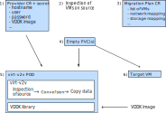

# Plan for Forklift 2.4

## Workflow overview




1)  *Provider CR:* The CR for VMware provider describing the source environment
    together with a secret are created in `konveyor-forklift` namespace. This can be
    done manually from the command line or through Forklift UI.

2)  Forklift controller performs inspection of the VMware environment and lists
    VMs, networks and storage domains.

3)  *Plan CR:* The CR describing the migration plan is created in
    `konveyor-forklift` namespace. The plan lists VMs to migrate, migration
    hooks and is accompanied by storage map and network map. The resources can
    be created manually from the command line or through Forklift UI.

4)  *PVs:* This is the first step that is different from Forklift 2.3. Forklift
    controller creates empty PVCs to get empty PVs in target namespace on
    destination.

5)  *Conversion Pod:* Forklift controller creates conversion pod with the PVs
    attached as well as provider CR and secret as environment. Pod entrypoint
    creates necessary symlinks to destination disks (both block and file).
    Further, it will assemble necessary arguments for virt-v2v, taking
    information about VM and source from environment variables. Finally
    entrypoint starts virt-v2v with `-o local` output mode. Virt-v2v would
    perform inspection of source metadata, conversion and data copying in
    normal manner.

6)  *VM:* After conversion is finished, Forklift controller creates VM in
    target namespace attaching the populated PVs to it.

## Necessary changes

* Use blank DataVolume to provision PV of correct size using CDI.
* Use virt-v2v to perform data copy.
* Introduce insecure mode. SSL fingerprint (thumbprint) is not adequate.
  virt-v2v/nbdkit does not accept SSL certificate which makes connection to
  source problematic even with VDDK.
* Add a VDDK sidecar container but also make the use of VDDK optional.
* Forklift constructs the `vpx://` URI and passes it to the conversion pod in the environment.
* Password and thumbprint stored in a secret, passed in the environment to the conversion pod.
* Entrypoint in conversion pod:
  * Prepares symlinks to target disks (for file and block PVs)
  * Assembles virt-v2v arguments based on environment variables in the pod.
  * Runs virt-v2v in `-o local` mode.

## Further plans for the future

* Add special `-o kubevirt` output to virt-v2v which would produce a YAML with
  VM configuration that could be then used by Forklift to create the final VM.
  Alternatively, virt-v2v could create the VM itself and Forklift would then
  patch the VM definition as necessary. However, the possibilities of patching
  existing VM need to be investigated first before pursuing this.

* Possibly let virt-v2v also create the target PVs with k8s API. This is
  however problematic, because PVs cannot be attached to existing pod.
  Consequently the conversion container would need to work in two steps chained
  together in tandem. This would duplicate (re-implement) the work that
  Forklift already does, but the conversion pod would be less coupled with
  Forklift and could potentially be triggered by CNV users for migration of a
  single VM.

* Add support for `esx://` connection. This requires configuration of
  credentials for each host of the VMware environment. The change may require
  non-trivial changes in UI, validation and controller which may rule it out
  from the 2.4 timeframe.


# Analysis of the use of virt-v2v in Forklift <= 2.3 and possible enhancments

Forklift attempts to use virt-v2v to import from VMware, but the way
it does it now does not generally work.  There are also many features
that virt-v2v provides which are not offered through Forklift.

## From VMware vCenter

The only current mode that Forklift provides is VMware vCenter (not
the more common ESXi) to a local guest on KubeVirt, so firstly we
should fix that so it works.

The only way that virt-v2v supports such conversions is by running
one of the following command lines:

```
virt-v2v \
    -ic 'vpx://root@vcenter.example.com/Datacenter/esxi?no_verify=1' \
    -ip passwordfile \
    "GUEST NAME" \
    -o kubevirt [...]
```

```
virt-v2v
    -ic 'vpx://root@vcenter.example.com/Datacenter/esxi?no_verify=1'
    -it vddk
    -io vddk-libdir=/path/to/vmware-vix-disklib-distrib
    -io vddk-thumbprint=xx:xx:xx:...
    "GUEST NAME"
    -o kubevirt [...]
```

The first version uses an HTTPS connection, which is slow but uses
entirely free software.  The second version uses VDDK, a proprietary
closed-source library, but will run much faster.

Note that virt-v2v directly connects to VMware, and this is required.

## -o kubevirt

There is a proposed enhancement to virt-v2v upstream to provide “-o
kubevirt” output mode.  In this mode, virt-v2v will write a KubeVirt
YAML file with the guest metadata.  KubeVirt must use this YAML file
to boot the guest (and not try to invent its own).

The guest disks are currently written to local files, but we intend to
change this so that we could write, for example, directly to devices
which have been attached to PVCs by the Forklift controller.  This
will require some work and coordination between KubeVirt, Forklift and
virt-v2v.

## From VMware ESXi

With the basics above fixed, we can then enhance Forklift's use of
virt-v2v to expose more features.  The first new feature that is
likely to be useful is support for importing from VMware ESXi.  This
is much more widely used than VMware vCenter.

Essentially it should work exactly the same way as imports
from vCenter above, using one of the two command lines above,
but with a small modification to the URI, replacing
`vpx://...` with `esx://root@esxi.example.com`

## From VMware OVA

Another very popular import method from VMware is to use an OVA file
(which is a kind of tar or zip file that contains the metadata and
disks).

The command line to use is:

```
virt-v2v -o ova guest.ova -o kubevirt [...]
```

A complication here is how to upload and provide the OVA file (a
regular file) to virt-v2v.

## From Xen

Although not frequently seen, virt-v2v can do conversions from Xen
over SSH.  The command line to use is:

```
virt-v2v \
    -ic 'xen+ssh://root@xen.example.com' \
    -ip passwordfile \
    guest_name \
    -o kubevirt [...]
```

## From local files

A final import method, mainly useful for testing, is to allow
importing from a plain, local disk image.  The command line to use is:

```
virt-v2v \
    -i disk \
    disk.img \
    -o kubevirt [...]
```

## Future work

Virt-v2v 2.0 offers some enhancements which could be useful to Forklift:

* Allow the copying to be offloaded to a separate process.  In this
mode virt-v2v will do the conversion and set up NBD pipelines on the
input and output sides, but defer copying to a separate process.  It's
anticipated that the Forklift controller could use this to schedule
copying across multiple virt-v2v conversions (eg. to control bandwidth
or total system load).

* Perform warm conversions.  In this mode, another process performs
the warm copy of the input guest before shutting it down and then
getting virt-v2v to do the final conversion and output.
